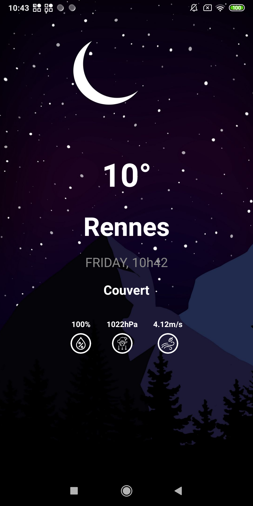
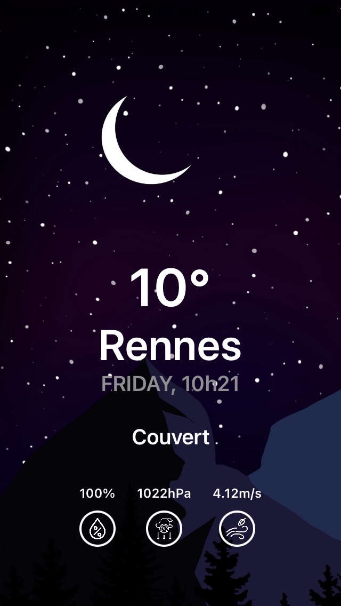

# KMM-weather

KMM-weather is a test project to practise KMM.

Android                    |  iOS
:-------------------------:|:-------------------------:
  |  

## Features

- WS weather : https://openweathermap.org/api
- SwiftUI / Compose
- ViewState with exposed ViewModel
- Koin

## Sources

- https://proandroiddev.com/kotlin-multiplatform-mvvm-clean-architecture-f20b99f90b95
- https://kotlinlang.org/docs/kmm-getting-started.html

## SDK

| SDK | Doc |
| ------ | ------ |
| Ktor | https://ktor.io/docs/http-client-multiplatform.html#add-dependencies |
| Moko | https://moko.icerock.dev/ |
| Compose | https://developer.android.com/jetpack/compose/setup |
| kotlinx-datetime | https://github.com/Kotlin/kotlinx-datetime |
| Koin | https://insert-koin.io/ |

